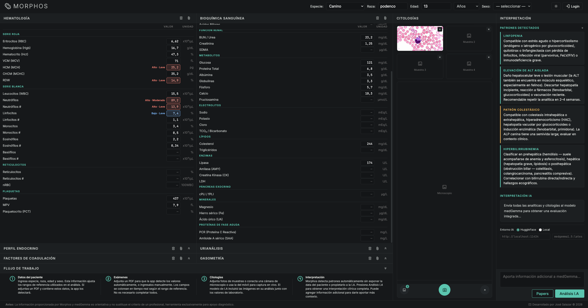
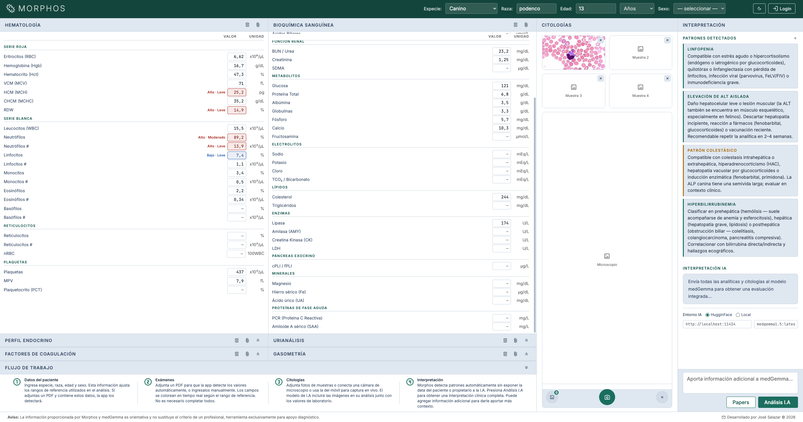
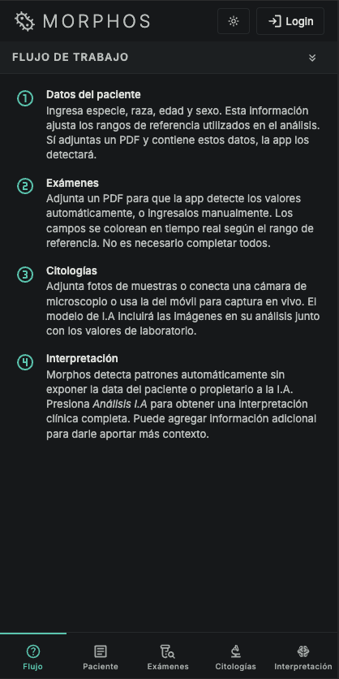
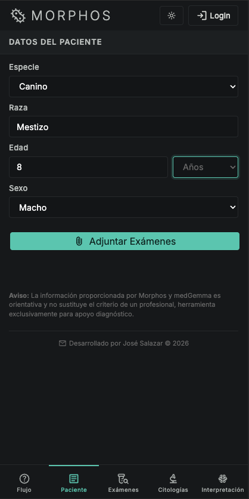
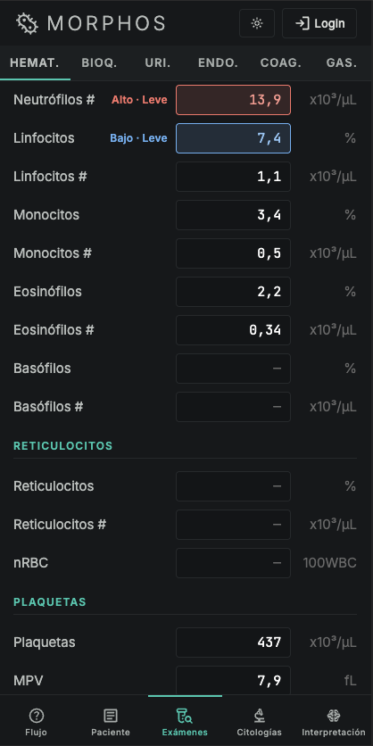
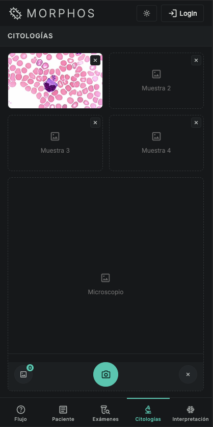
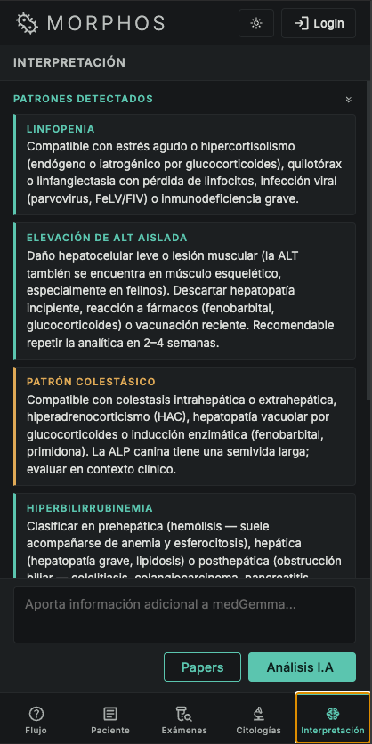
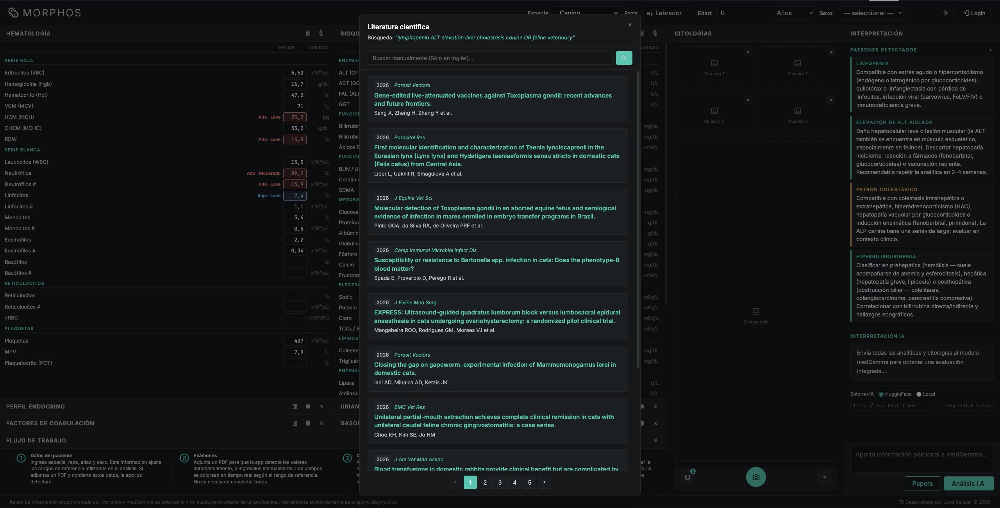

# Morphos — Intérprete de analíticas veterinarias asistido por I.A

## Proyecto final — Curso de Desarrollo Web 2026

---

## Descripción

Morphos es una aplicación web de apoyo al diagnóstico veterinario. Detecta patrones clínicos en tiempo real a partir de valores de laboratorio usando un motor propio de JS puro con la opción de interpretarlos mediante un modelo de inteligencia artificial especializado en medicina (medGemma 1.5 4B it multimodal de Google Deep Mind), incluye una sección de búsqueda de artículos cientíticos en PubMed relacionados con los diagnósticos diferenciales del paciente.

Está orientada a caninos y felinos, con ajuste automático de rangos de referencia por especie, edad, raza y sexo.
Ataca una necesidad real del sector veterinario que actualmente no dispone de herramientas de este tipo que sean gratuitas y de fácil uso y que permitan obtener información complementaria relevante sobre sus pacientes en muy poco tiempo y sin exponer la data sensible a los LLM.

<a href="https://blackmistcode-morphos.hf.space/">Enlace a Morphos</a>


Funcionalidades principales:

```text
Detección de patrones clínicos en tiempo real con motor nativo de JS
Interpretación con IA (HuggingFace o Ollama local)
Importación de resultados desde PDF
Análisis de citologías mediante imágenes 
Búsqueda de literatura científica en PubMed
Sistema de autenticación con registro e inicio de sesión
```

---

## Capturas de pantalla

**Tema oscuro**


**Tema claro**


**Vista móvil**

| | | | | |
|---|---|---|---|---|
|  |  |  |  |  |

**Modal de literatura científica**


---

## Objetivo del proyecto

Integrar los conocimientos del curso en una aplicación web completa que además sea útil y
cubra una necesidad de mercado:

```text
HTML semántico y accesible
CSS personalizado (variables, grid, responsive)
JavaScript modular
Sin uso de frameworks
PHP como backend de API (proxy, autenticación, base de datos)
```

Conceptos aplicados:

* Separación de responsabilidades por módulos
* Comunicación asíncrona con `fetch` (JSON y SSE)
* Sesiones PHP y autenticación con PDO
* Contraseñas hasheadas con `password_hash`
* Consultas preparadas para prevenir inyección SQL
* Detección de patrones mediante lógica clínica codificada

---

## Estructura del proyecto

```text
/api
    auth.php         → login, registro y cierre de sesión (PDO + sesiones)
    conexion.php     → conexión a la base de datos MySQL
    hf_proxy.php     → proxy hacia HuggingFace Space (oculta la API key)
    papers_proxy.php → consulta PubMed con caché de 30 minutos
    setup.php        → crea la base de datos y la tabla de usuarios
    .env             → variables de entorno (HF_API_KEY, DB_PORT)

/js
    main.js          → orquestación general, eventos y renderizado
    analisis.js      → motor de detección de patrones clínicos
    ia.js            → construcción del prompt y llamadas al modelo IA
    ui.js            → navegación por tabs, gestos, sincronización móvil
    auth.js          → modal de autenticación y validación en tiempo real
    papers.js        → búsqueda y paginación de literatura científica
    pdf-parser.js    → extracción de valores desde PDF en el navegador

/css
    styles.css       → estilos completos (tema claro/oscuro, grid, mobile)

/data
    valores_referencia.json → rangos de referencia por especie y analito
    alteraciones.json       → descripciones clínicas de los patrones

/assets
    /fonts           → Inter y JetBrains Mono (carga local)
    /icons           → iconos SVG de la interfaz
    /lib/pdfjs       → librería PDF.js en local

index.html           → SPA principal
.htaccess            → compresión, caché y protección de archivos sensibles

/docs
    /screenshots     → capturas de pantalla de la interfaz
```

---

## Flujo de la aplicación

```text
[ Formulario de valores ]
        |
        v
   analisis.js
   (deteccion de patrones en tiempo real, sin servidor)
        |
        v
[ UI: campos coloreados + tarjetas de patron ]
        |
        v
  Usuario pulsa "Analisis IA"
        |
        v
   ia.js (construye el prompt con los hallazgos)
        |
      ┌─┴──────────────┐
      v                v
 HuggingFace       Ollama local
 (hf_proxy.php)    (/v1/chat/completions)
      |                |
      └────────┬────────┘
               v
     [ Interpretacion en pantalla ]
```

---

## Instalacion

### 1. Requisitos

* XAMPP (Apache + PHP 8.1+ + MySQL)
* El proyecto ubicado en `htdocs/morphos_proyecto_final/`

### 2. Variables de entorno

Crear el archivo `api/.env`:

```text
HF_API_KEY=tu_clave_de_huggingface
DB_PORT=3306
```

### 3. Base de datos

Acceder en el navegador a:

```text
http://localhost/morphos_proyecto_final/api/setup.php
```

Esto crea la base de datos `morphos_db` y la tabla `usuarios`. El archivo puede eliminarse tras ejecutarse.

### 4. Iniciar la aplicacion

Iniciar Apache y MySQL desde el panel de XAMPP y abrir:

```text
http://localhost/morphos_proyecto_final/
```

O bien con el servidor integrado de PHP desde la raiz del proyecto:

```bash
php -S localhost:8000
```

## Backend de IA

El modelo de IA se configura desde la propia interfaz. La seleccion se guarda en `localStorage`.

| Opcion                    | Descripcion                                                                |
| ------------------------- | -------------------------------------------------------------------------- |
| HuggingFace (por defecto) | Llama al Space `blackmistcode-morphos-medgemma` a traves del proxy PHP   |
| Local (Ollama)            | Llama directamente a `http://localhost:11434` con `medgemma1.5:latest` |

Para usar Ollama, debe estar ejecutandose con `ollama serve` y el modelo descargado.

---

## Motor de deteccion de patrones

`analisis.js` compara cada valor ingresado contra los rangos de referencia del JSON, ajustados dinamicamente segun:

* **Especie**: canino / felino
* **Edad**: cachorro, adulto, senior, geriatrico
* **Raza**: galgo/whippet (RBC y plaquetas), Shiba/Akita (RBC)
* **Sexo**: felinos machos tienen mayor tolerancia a creatinina

La gravedad se calcula como la desviacion relativa al ancho del rango de referencia. Con los hallazgos se identifican mas de 50 patrones clinicos (anemias, hepatopatias, nefropatia, alteraciones endocrinas, electrolitos, entre otros).

---

## Seguridad aplicada

* Consultas SQL con sentencias preparadas (sin interpolacion directa)
* Contrasenas hasheadas con `password_hash` / `password_verify`
* API key de HuggingFace protegida en servidor, nunca expuesta al cliente
* Archivos `.env` y `setup.php` bloqueados por `.htaccess`
* Datos externos de APIs sanitizados con `textContent` antes de insertarse en el DOM
* Sin uso de `eval`, `document.write` ni `innerHTML` con datos externos

---

## Conceptos del curso aplicados

* HTML5 semantico
* CSS personalizado: variables, fuentes fluidas, grid, flexbox, media queries, temas claro/oscuro
* JavaScript: ES Modules, `fetch`, `async/await`, eventos, DOM API
* PHP: sesiones, PDO, proxy HTTP con cURL, lectura de `.env`, caché en disco
* MariaDB: creacion de tablas, consultas con parametros, indices unicos

---

## Mejoras futuras

* Implementación de dashboard de administrador
* Desarrollo de extensión de navegador para captar datos del DOM de PIMS y obtener los datos de los analisis de los pacientes con intervención mínima del usuario
* Desarrollo de mobile app dedicada
* Integración con PIMS más utilizados en veterinaria
* Rankeo de papers basado en confiabilidad y relevancia
* Creación de Dataset específico para citologías de animales
* Hosting del modelo en VPS serverless para finetuning y menor latencia
* Ampliación de la base de alteraciones
* Parseo con OCR de fotografías de analíticas
* Incluir resultados de gasometría, coprologías, informes de histopatologías y tiempos de coagulación

## Retos

* Por la diversidad de unidades de medición que utilizan los diferentes fabricantes de equipos de laboratorio se incorporó una detección de unidades para su conversión y normalización
* El modelado del output de la I.A requirió muchísimas iteraciones de formateo del prompt y harness para evitar alucinaciones o que envíara su proceso de pensamiento, aún requiere de mucho trabajo extra de refinamiento
* Inicialmente quería usar proveedores de inferencia gratuita de medGemma (como featherless AI) pero fallaban continuamente, por eso decidí optar por hostear al modelo en Zero GPU de HF con la subscripción pro para la prueba de concepto
* Incluir las librería de parseo de pdf y las fuentes en el directorio del proyecto con la intención de reducir dependencias externas estaba generando problemas con las métricas de velocidad de lighthouse que no lograba solucionar. Claude planteó implementación de caché en htacesss y pre carga de las fuentes, lo cual llevó la puntuación de 60 a 90/100 sin mayores cambios estructurales
* Lograr una interfaz limpia y entendible requirío de muchos intentos hasta lograr un flujo de trabajo intuitivo y accsesible con la mínima friccion posible para los usuarios
* La API de PubMed sólo admite input en inglés, así que implementó un objeto con traducciones de los patrones clínicos más comúnes para poder realizar las peticiones

## Notas

* `api/setup.php` puede eliminarse una vez creada la base de datos
* El parser de PDF funciona completamente en el navegador (sin subida al servidor) para evitar enviar información privada al modelo de IA.
* La busqueda de literatura filtra los patrones detectados, los traduce al ingles y consulta PubMed via `esearch` + `esummary`
